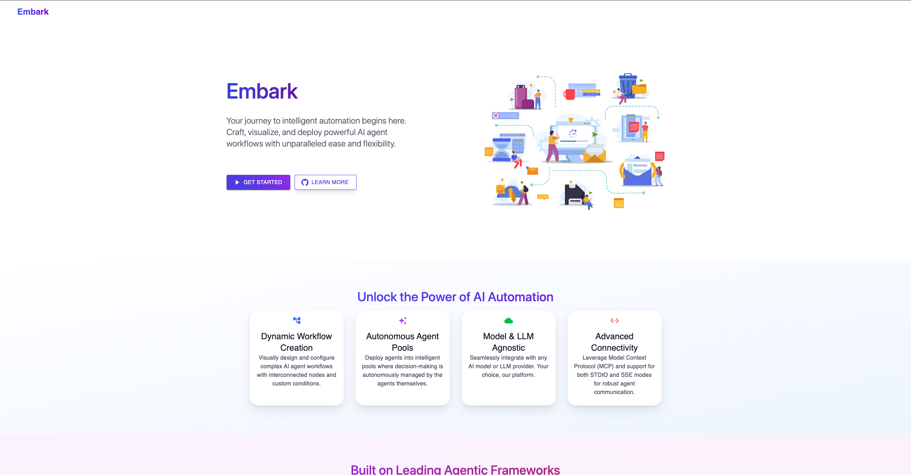
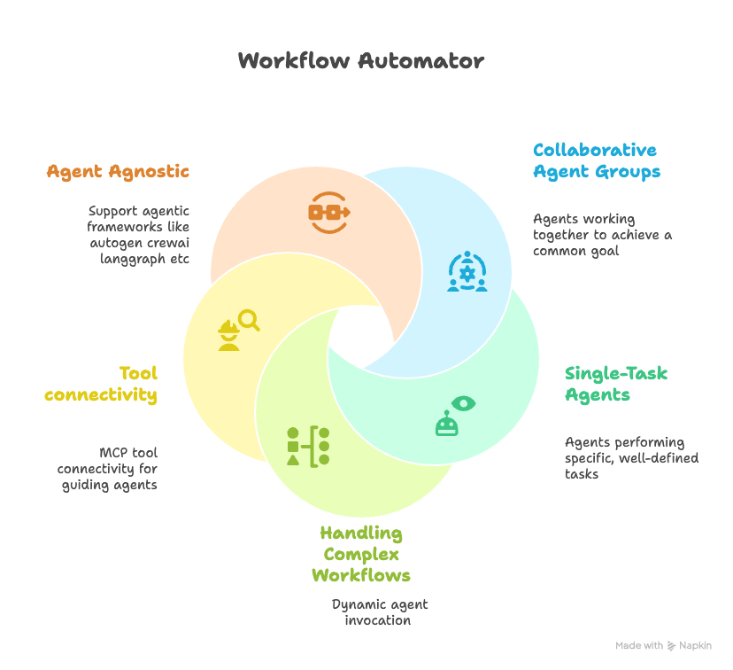
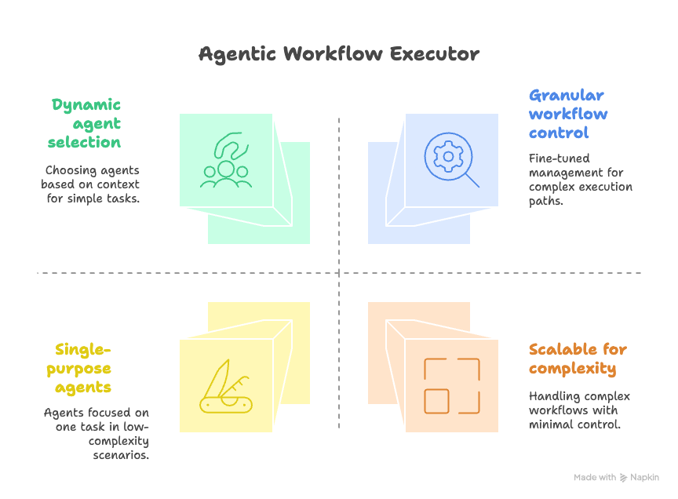
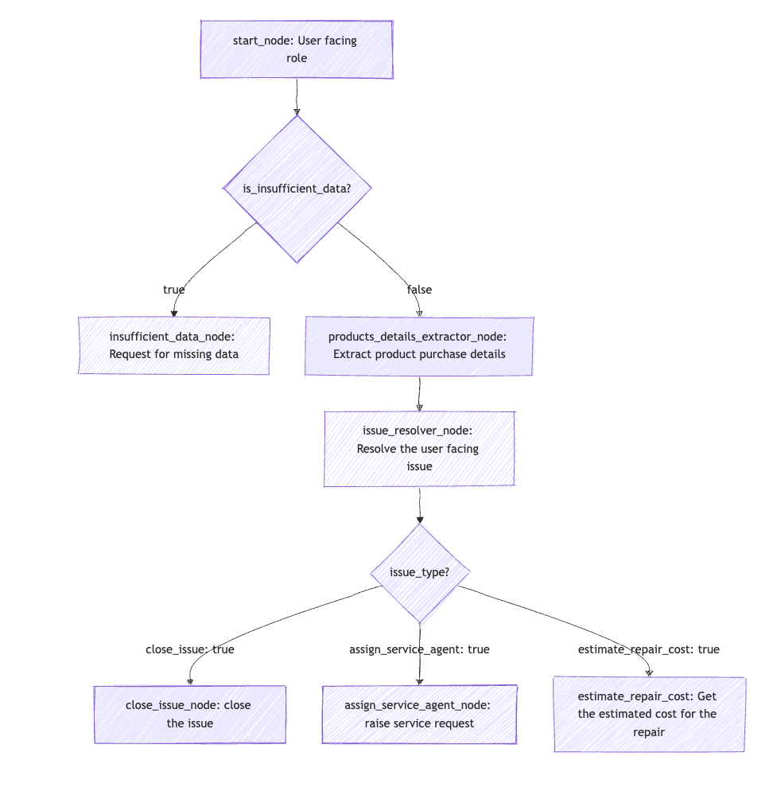
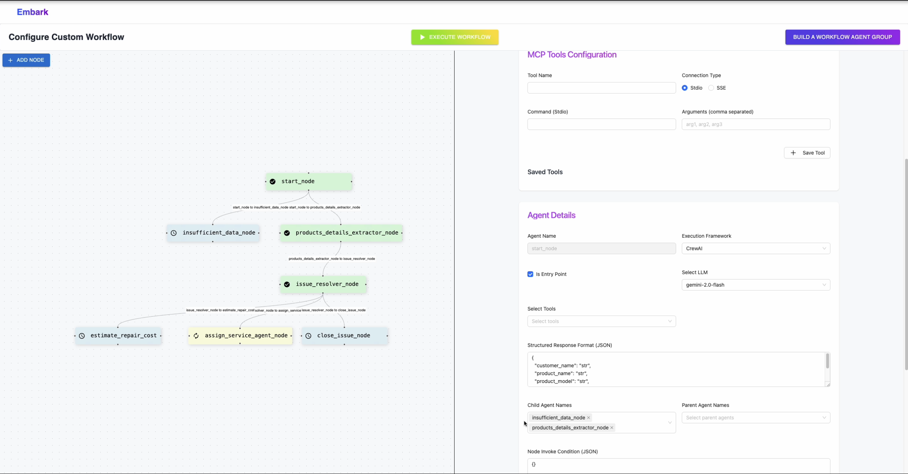
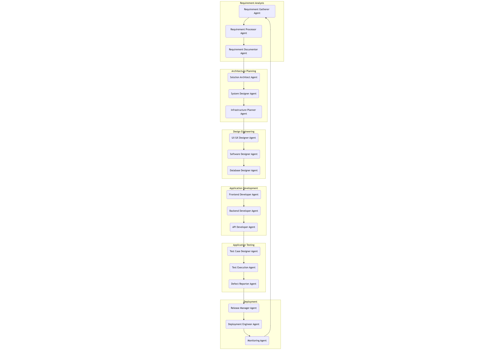
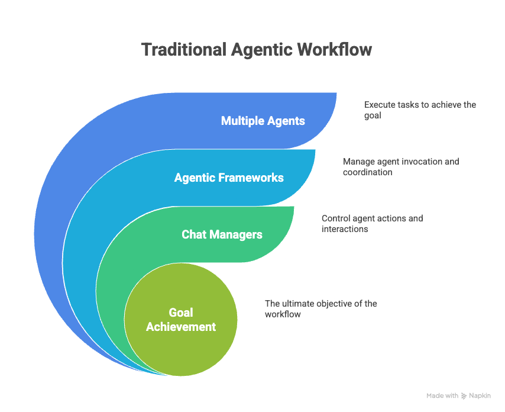
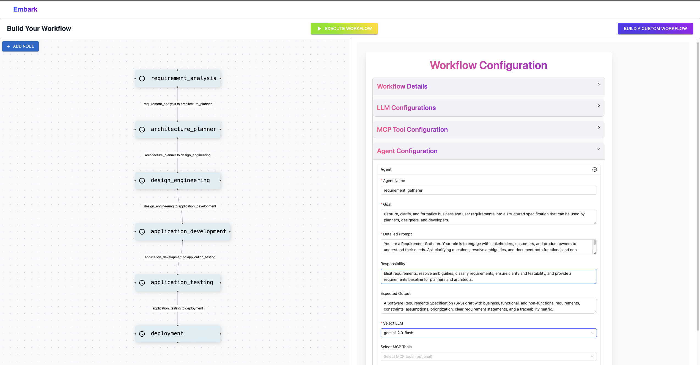

# Embark: Dynamic Agentic Workflow Automation

A proof-of-concept project demonstrating the creation and execution of dynamic, conditional agentic workflows.

This project is a work in progress, showcasing an innovative approach to building scalable and efficient agentic systems. It highlights the capability to create agents and define complex workflows at runtime, allowing for dynamic decision-making and improved efficiency over traditional methods.

### Landing Page


### Features


## Features

**1. Traditional Agentic Execution**

This approach utilizes a central chat manager to handle agent invocation, where multiple agents work together to solve a single task.

**Potential Issues:** This method can face challenges with context limits and inefficient agent invocation, making it less suitable for complex or conditional workflows.

**2. Custom Agent Workflow Execution**

This is the core of the project. It showcases a system where agents are configured and linked together in a cyclic graph. Each agent is designed to perform one specific task and then make a dynamic decision based on the current state. The output of one agent determines which agent is triggered next.

**Advantages:**

*   **One task, one agent:** Each agent is highly focused and efficient.
*   **Dynamic Decision-Making:** The workflow can adapt in real-time based on conditional outputs.
*   **Scalable:** Can handle complex workflows with hundreds of conditionally linked nodes.
*   **Increased Efficiency:** Agents are only invoked when needed, leading to better resource utilization.
*   **Greater Control:** Provides more granular control over the entire workflow process.

## Getting Started

This project is a full-stack application with a Python backend and a React frontend. To get it up and running, follow these steps.

### Prerequisites

*   Python 3.9+
*   Node.js 18+
*   Git

### Setup

**Backend (Python Server)**

1.  Navigate to the Python server directory.

    ```bash
    cd Embark-Python-Server
    ```

2.  Install the required Python dependencies.

    ```bash
    pip install -r requirements.txt
    ```

3.  Create a `.env` file with your API keys and configuration settings.

    ```
    # Example .env file
    # GEMINI_API_KEY="your_gemini_key_here"
    ```

    Set the key in main method
    ```
    gemini_key = os_getenv("GEMINI_API_KEY")
    os_environ["GEMINI_API_KEY"] = gemini_key
    ```

4.  Run the Python server.

    ```bash
    python main.py
    ```

**Frontend (React App)**

1.  Open a new terminal and navigate to the React app directory.

    ```bash
    cd Embark-React-App
    ```

2.  Install the Node.js dependencies.

    ```bash
    npm install
    ```

3.  Start the development server.

    ```bash
    npm run dev
    ```

The application should now be running and accessible in your web browser.

## Roadmap & Known Issues

**TODO:**

*   Single agent multiple MCP integration: Allowing a single agent to handle multiple "Message, Control, and Processing" integrations.
*   Session management: Implementing robust user session handling.
*   Agent Directory: A feature to save and reuse configured agents.
*   AI workflow creator: Using AI to generate workflows from natural language descriptions.
*   User management: Basic user authentication and management features.

**Bugs:**

*   MCP tool integration: The current tool integration is static and needs to be dynamic.
*   UI workflow creation enhancements: Improving the user interface for creating workflows.

## Contributing

We welcome contributions! 🚀  
If you believe in this feature and would like to help shape it into a full-fledged application, your ideas, improvements, and pull requests are always appreciated.

# IMAGES

## Custom Workflow Images

### Custom Workflow Feature


### Custom Workflow Example (Mermaid)


### Custom Workflow Example (UI)



## Traditional Workflow Images

### Traditional Workflow Example (Mermaid)


### Traditional Workflow Feature


### Traditional Workflow Builder (UI)


